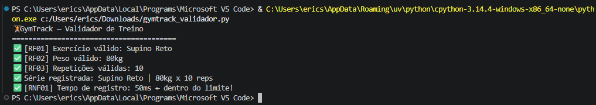

# 🗂️ Portfólio — Engenharia de Software | FIAP 2026

## Sobre este repositório
Portfólio individual desenvolvido ao longo do semestre na disciplina de Engenharia de Software (3º Ano — Engenharia de Computação). Cada pasta corresponde a uma aula e contém o código Python, os diagramas UML (quando aplicável) e o print da execução.

**Prof. Hercules Ramos | FIAP 2026**

---

## Como executar os exercícios

### Pré-requisitos
- Python 3.x instalado **ou** acesso ao [Google Colab](https://colab.research.google.com)

### Instalação
```bash
# Clone o repositório
git clone https://github.com/Tibin05/checkpoint3-engenharia-software.git

# Entre na pasta desejada
cd aula-03-requisitos

# Execute o código
python gymtrack_validador.py
```

---

## Exercícios por Aula

---

### Aula 03 — Requisitos Funcionais vs. Não-Funcionais

#### 💻 Código
Arquivo: [`aula-03-requisitos/gymtrack_validador.py`](aula-03-requisitos/gymtrack_validador.py)

O código implementa o sistema **GymTrack**, um validador de treinos de academia. Foram aplicados Requisitos Funcionais (validação de nome do exercício, peso e repetições) e Requisitos Não-Funcionais (tempo de resposta inferior a 200ms), colocando em prática a distinção entre *o que* o sistema faz e *como* ele se comporta.

#### ▶️ Execução


O output exibe as validações de RF e RNF com sucesso, confirmando que o sistema aceita dados válidos e registra a série dentro do limite de tempo.

---

### Aula 04 — Documento SRS

#### 💻 Código
Arquivo: [`aula-04-srs/srs_marketplace.py`](aula-04-srs/srs_marketplace.py)

*(Em breve)*

#### ▶️ Execução


*(Em breve)*

---

### Aula 05 — UML e Casos de Uso

#### 🗺️ Diagrama


*(Em breve)*

#### 💻 Código
Arquivo: [`aula-05-casos-de-uso/biblioteca_digital.py`](aula-05-casos-de-uso/biblioteca_digital.py)

*(Em breve)*

#### ▶️ Execução


*(Em breve)*

---

### Aula 06 — Diagramas de Atividades

#### 🗺️ Diagrama


*(Em breve)*

#### 💻 Código
Arquivo: [`aula-06-atividades/cadastro_usuario.py`](aula-06-atividades/cadastro_usuario.py)

*(Em breve)*

#### ▶️ Execução


*(Em breve)*

---

### Aula 07 — Diagramas de Sequência

#### 🗺️ Diagrama


*(Em breve)*

#### 💻 Código
Arquivo: [`aula-07-sequencia/transferencia_nubank.py`](aula-07-sequencia/transferencia_nubank.py)

*(Em breve)*

#### ▶️ Execução


*(Em breve)*

---

### Aula 08 — Diagramas de Classes

#### 🗺️ Diagrama


*(Em breve)*

#### 💻 Código
Arquivo: [`aula-08-classes/streaming_netflix.py`](aula-08-classes/streaming_netflix.py)

*(Em breve)*

#### ▶️ Execução


*(Em breve)*

---

### Aula 09 — Arquitetura MVC

#### 🖼️ Imagens


*(Em breve)*

---

## Links
- 🏫 [FIAP](https://www.fiap.com.br)
- 👨‍🏫 Professor: Hercules Ramos — profhercules.ramos@fiap.com.br
