# 🗂️ Portfólio — Engenharia de Software | FIAP 2026

## Sobre este repositório
Portfólio individual desenvolvido ao longo do semestre na disciplina de Engenharia de Software (3º Ano — Engenharia de Computação). Cada pasta corresponde a uma aula e contém o código Python, os diagramas UML (quando aplicável) e o print da execução.

**Prof. Hercules Ramos | FIAP 2026**

---

## Como executar os exercícios

### Pré-requisitos
- Python 3.x instalado **ou** acesso ao [Google Colab](https://colab.research.google.com)

### Instalação
```bash
git clone https://github.com/Tibin05/checkpoint3-engenharia-software.git
cd aula-03-requisitos
python gymtrack_validador.py
```

---

## Exercícios por Aula

---

### Aula 03 — Requisitos Funcionais vs. Não-Funcionais

#### 💻 Código
Arquivo: [`aula-03-requisitos/gymtrack_validador.py`](aula-03-requisitos/gymtrack_validador.py)

O código implementa o sistema **GymTrack**, um validador de treinos de academia. Foram aplicados 3 Requisitos Funcionais (RF01: validação do nome do exercício, RF02: peso entre 1 e 300kg, RF03: repetições entre 1 e 50) e 1 Requisito Não-Funcional (RNF01: tempo de registro inferior a 200ms). O exercício demonstra na prática a diferença entre *o que* o sistema faz (RF) e *como* ele deve se comportar (RNF).

#### ▶️ Execução


O output exibe as validações de RF e RNF com sucesso: o sistema aceita os dados do exercício "Supino Reto" (80kg, 10 repetições) e registra a série em 52ms, dentro do limite de 200ms estipulado pelo RNF01.

---

### Aula 04 — Documento SRS

#### 💻 Código
Arquivo: [`aula-04-srs/srs_marketplace.py`](aula-04-srs/srs_marketplace.py)

O código implementa um **SRS (Software Requirements Specification)** em Python para o FIAP Marketplace, um sistema de vendas entre alunos. Foram definidos 3 RFs (Cadastro de Produto, Busca por Categoria, Checkout) e 2 RNFs (Disponibilidade 99,9% e LGPD), seguindo o padrão IEEE 830. Inclui a função `validar_requisito()` que verifica se cada RF segue as boas práticas SMART (específico, mensurável, com pré-condição definida).

#### ▶️ Execução
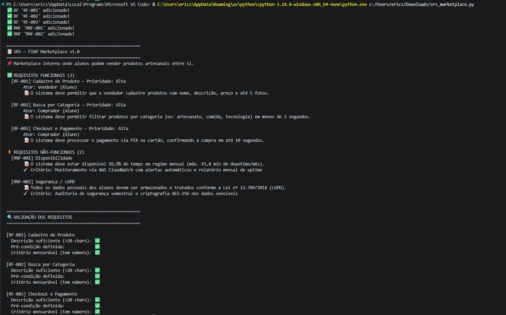

O output mostra a criação e validação dos requisitos do FIAP Marketplace, com o relatório final listando os 3 RFs e 2 RNFs e a análise SMART de cada requisito.

---

### Aula 05 — UML e Casos de Uso

#### 🗺️ Diagrama
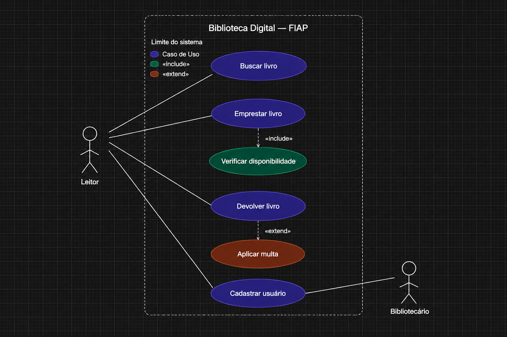

O diagrama representa o sistema de **Biblioteca Digital FIAP** com os atores Leitor e Bibliotecário. Foram modelados 6 casos de uso dentro do limite do sistema. O relacionamento `<<include>>` entre "Emprestar livro" e "Verificar disponibilidade" indica que a verificação sempre ocorre. O `<<extend>>` entre "Aplicar multa" e "Devolver livro" indica que a multa só é aplicada em casos de atraso.

#### 💻 Código
Arquivo: [`aula-05-casos-de-uso/biblioteca_digital.py`](aula-05-casos-de-uso/biblioteca_digital.py)

O código implementa os 4 casos de uso principais: UC-01 (listar catálogo), UC-02 (buscar livro), UC-03 (emprestar com `<<include>>` de verificação de disponibilidade) e UC-04 (devolver com `<<extend>>` de multa por atraso). Inclui versão OOP com classes `Livro` e `Biblioteca`, mostrando como os casos de uso do diagrama se traduzem em métodos de classe.

#### ▶️ Execução
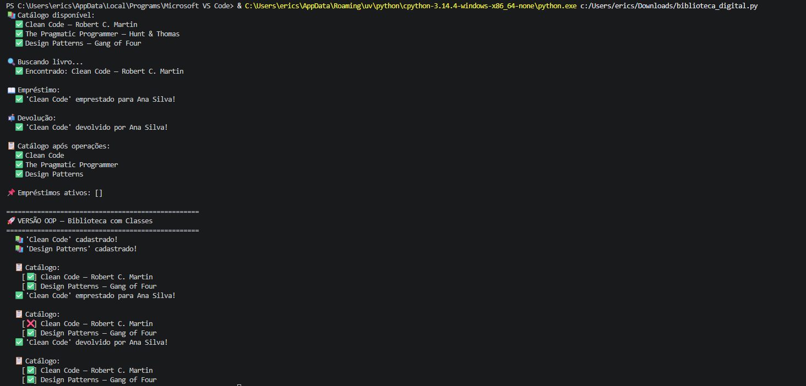

O output demonstra o fluxo completo: listagem do catálogo, busca pelo termo "clean", empréstimo de "Clean Code" para Ana Silva e devolução com atualização do status de disponibilidade.

---

### Aula 06 — Diagramas de Atividades

#### 🗺️ Diagrama
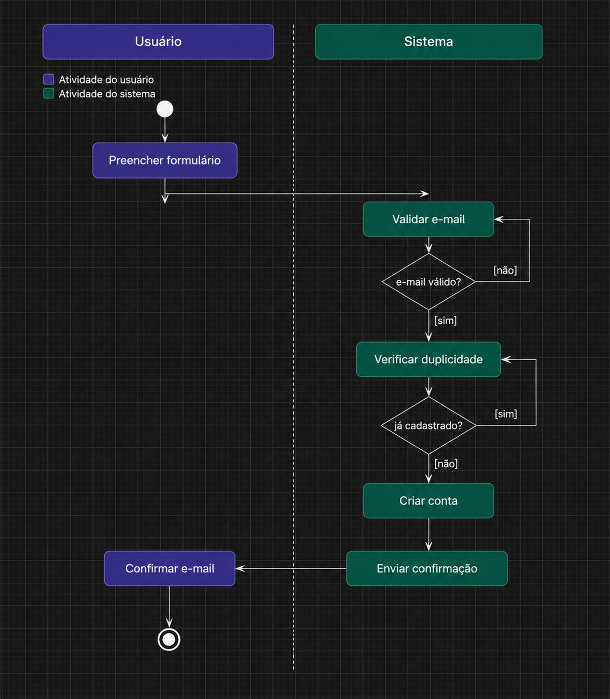

O diagrama modela o processo de **Cadastro e Aprovação de Usuário** com swimlanes para Usuário e Sistema. O fluxo inclui nó inicial, duas decisões (`[e-mail válido?]` e `[já cadastrado?]`), atividades em raias separadas e nó final. As transições estão rotuladas com `[sim]` e `[não]`, tornando visível cada caminho possível do processo.

#### 💻 Código
Arquivo: [`aula-06-atividades/cadastro_usuario.py`](aula-06-atividades/cadastro_usuario.py)

O código implementa dois fluxos baseados nos diagramas: Login com Google OAuth (decisões de autorização e token) e Cadastro de Usuário (validação de e-mail, verificação de duplicidade, envio de confirmação e liberação de acesso). Cada `if` no código corresponde a um losango de decisão no diagrama, evidenciando a relação direta entre modelagem e implementação.

#### ▶️ Execução
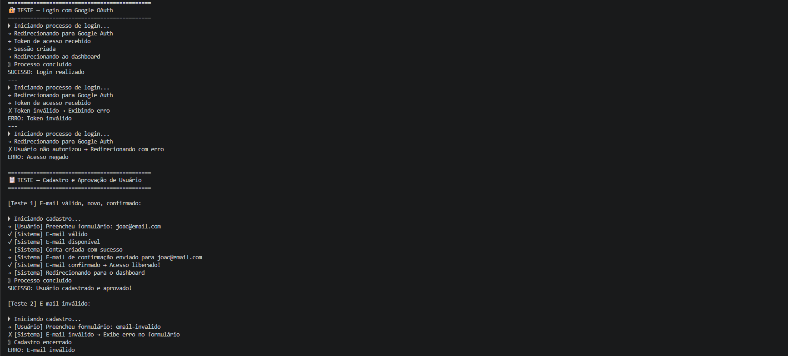

O output mostra os 4 cenários de teste: e-mail válido e confirmado (sucesso), e-mail inválido (erro de formato), e-mail já cadastrado (duplicidade) e confirmação não realizada (cadastro expirado).

---

### Aula 07 — Diagramas de Sequência

#### 🗺️ Diagrama
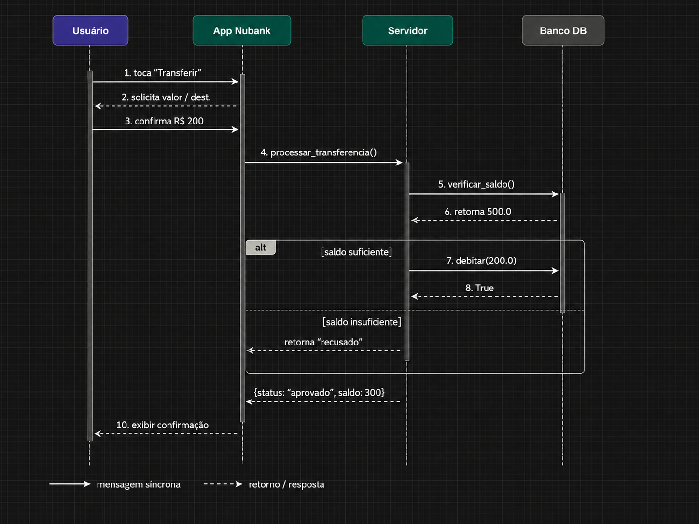

O diagrama modela o fluxo de **Transferência no App Nubank** com 4 participantes: Usuário, App Nubank, Servidor e Banco de Dados. Setas sólidas representam chamadas síncronas e tracejadas representam retornos. O fragmento `[alt]` mostra as duas alternativas: saldo suficiente (débito aprovado) e saldo insuficiente (transferência recusada). O tempo flui de cima para baixo.

#### 💻 Código
Arquivo: [`aula-07-sequencia/transferencia_nubank.py`](aula-07-sequencia/transferencia_nubank.py)

O código implementa o diagrama com 3 classes representando os participantes: `BancoDeDados` (gerencia saldos), `ServidorNubank` (implementa o fragmento `[alt]`) e `AppNubank` (coordena e exibe o resultado). A arquitetura reflete exatamente o fluxo de mensagens modelado no diagrama de sequência.

#### ▶️ Execução
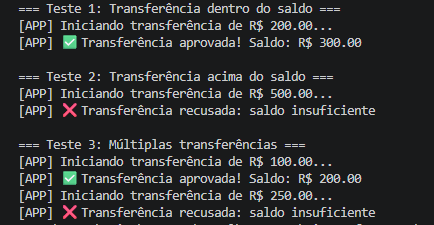

O output valida 3 cenários: transferência de R$200 aprovada (saldo restante R$300), transferência de R$500 recusada (saldo insuficiente) e múltiplas transferências sequenciais com atualização correta do saldo.

---

### Aula 08 — Diagramas de Classes

#### 🗺️ Diagrama
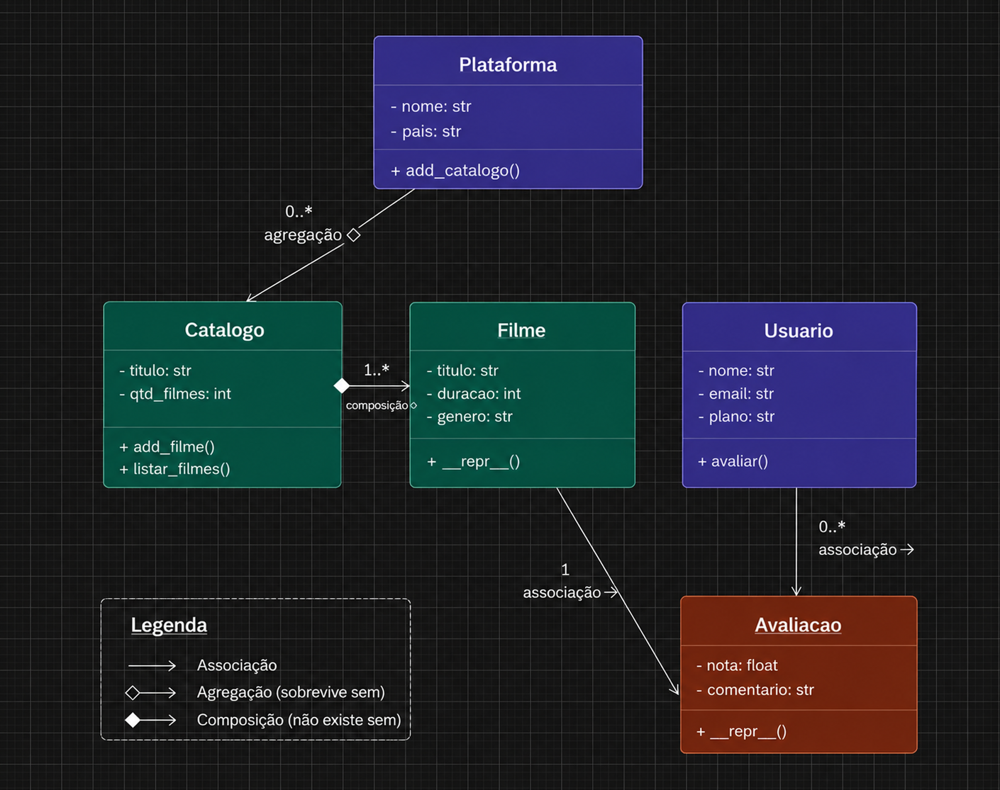

O diagrama modela o **Sistema de Streaming** (tipo Netflix) com 5 classes: `Plataforma`, `Catalogo`, `Filme`, `Usuario` e `Avaliacao`. Os 3 tipos de relacionamento estão representados: Composição ◆ entre `Catalogo` e `Filme` (filme não existe sem catálogo), Agregação ◇ entre `Plataforma` e `Catalogo` (catálogo sobrevive sem a plataforma) e Associação → entre `Usuario`/`Avaliacao` e `Avaliacao`/`Filme`.

#### 💻 Código
Arquivo: [`aula-08-classes/streaming_netflix.py`](aula-08-classes/streaming_netflix.py)

O código implementa as 5 classes mapeadas do diagrama UML. A composição é implementada criando objetos `Filme` internamente no `Catalogo`; a agregação passando `Catalogo` por referência para `Plataforma`; a associação com `Usuario` referenciando objetos existentes. O exercício demonstra como o diagrama de classes é o blueprint direto do código OO.

#### ▶️ Execução
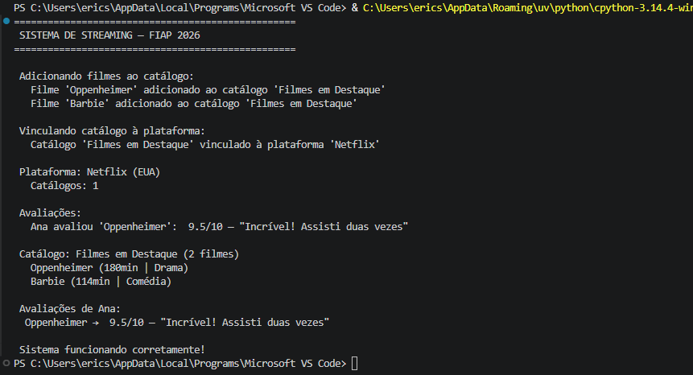

O output exibe a criação da plataforma Netflix, adição dos filmes Oppenheimer e Barbie ao catálogo, avaliação 9.5 do Oppenheimer pelo usuário Ana e listagem final com todas as informações.

---

### Aula 09 — Arquitetura MVC

#### 🗺️ Diagrama MVC
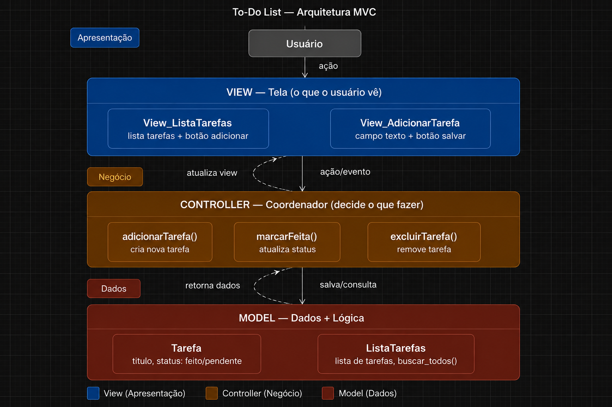

O diagrama representa a arquitetura MVC do **To-Do List** com as 3 camadas: View (telas de lista e adição de tarefas), Controller (ações de adicionar, marcar como feita e excluir) e Model (entidade Tarefa com título e status). As setas mostram o fluxo completo: usuário → View → Controller → Model → Controller → View → usuário, evidenciando a separação de responsabilidades de cada camada.

#### 🖼️ Protótipo Figma
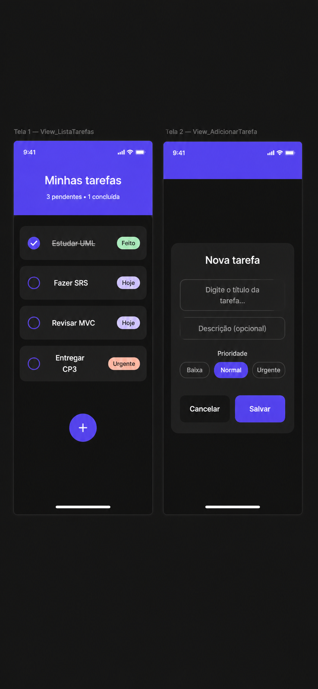

O protótipo apresenta 2 telas mobile (`View_ListaTarefas` e `View_AdicionarTarefa`) conectadas por prototype links. A Tela 1 exibe a lista de tarefas com status visual (pendente/feito), tags de prioridade e botão "+" para adicionar. A Tela 2 apresenta o modal com campo de título, seletor de prioridade (Baixa/Normal/Urgente) e botões Cancelar e Salvar, simulando a navegação real do app.

---

## Links
- 🏫 [FIAP](https://www.fiap.com.br)
- 👨‍🏫 Professor: Hercules Ramos — profhercules.ramos@fiap.com.br
